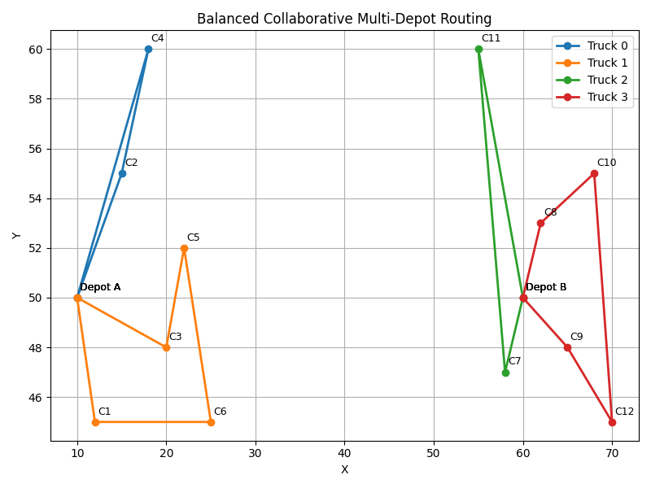

# Collaborative Multi-Depot Delivery Routing System

## 📌 Overview
This project develops a **collaborative multi-depot delivery routing system** using **Google OR-Tools**. The model ensures that all vehicles are utilized while balancing customer assignments across depots. The optimization reduces travel distance and guarantees that no vehicle remains idle.

- Multi-depot setup with spatially distributed customers.
- Balanced load distribution across all available trucks.
- Integrated capacity, distance, and fairness constraints.
- Visualized routes with **Matplotlib** for better interpretability.

## 🎯 Objectives
- Minimize the total delivery distance while using all available trucks.
- Ensure balanced workload distribution across depots.
- Respect vehicle capacity limits and maximum travel distances.
- Guarantee that each vehicle serves at least one customer.

## 🛠️ Methodology
1. Defined depot and customer coordinates with **Euclidean distance matrix**.
2. Applied **OR-Tools Vehicle Routing Problem (VRP)** solver with custom constraints:
   - Capacity dimension (max 4 deliveries per truck)
   - Distance dimension (120 units per truck)
   - Arc-count constraint to enforce minimum one delivery per vehicle
3. Implemented **Guided Local Search** metaheuristic to refine solutions.
4. Visualized routes per vehicle using **Matplotlib plotting**.

## 📊 Key Results
- Generated balanced delivery routes where all vehicles were active.
- Reduced overall travel distance while maintaining depot-customer proximity.
- Clear visualization of optimized routes for easy interpretation.
- Demonstrated practical applicability for last-mile logistics and collaborative distribution systems.

## 📷 Example Output


## 🚀 How to Run
```bash
python collaborative_routing_balanced.py
